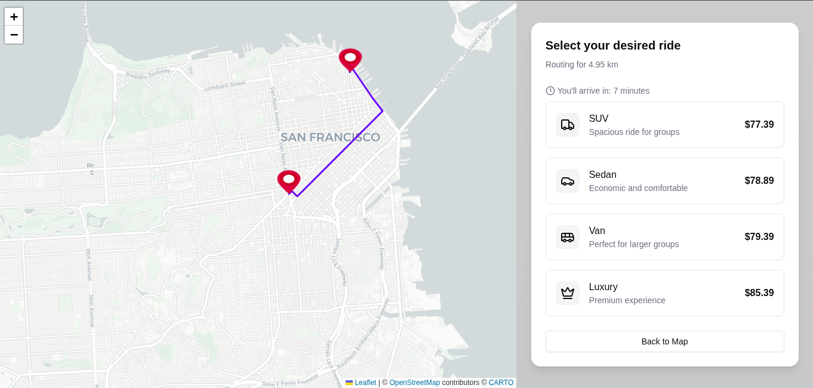
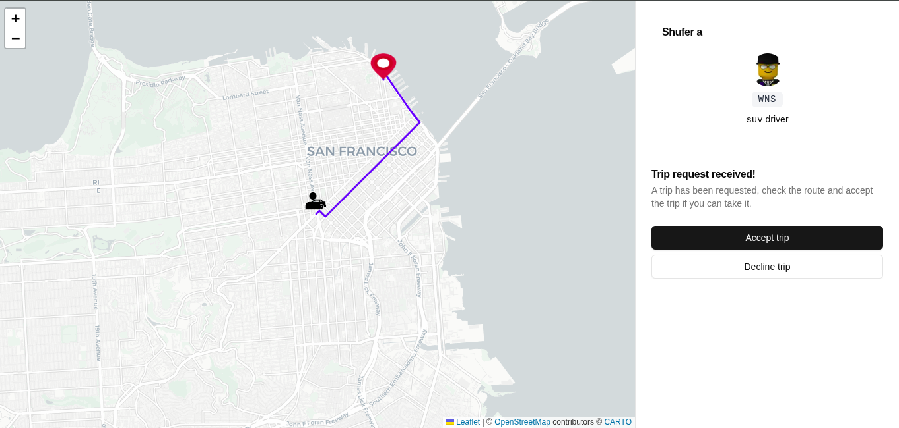

# Ride-Sharing Microservices Platform

A distributed Uber-style ride-sharing backend built with Go, gRPC, RabbitMQ, and Kubernetes.

This project was built as a **portfolio-grade distributed systems exercise** to demonstrate how modern backend platforms are designed, implemented, and deployed in production environments.

Rather than stopping at a simple microservices tutorial, the project focuses on real-world engineering concerns:

- Event-driven service communication
- Resilient messaging with retries and dead-letter queues
- Containerized services
- Kubernetes orchestration
- Distributed tracing
- Production-style deployment workflows

The goal is to showcase how a ride-sharing backend system similar to Uber can be structured using Go microservices.

---

# Project Overview

The platform simulates the backend architecture of a ride-sharing system.

Users request trips through the frontend application. The request flows through multiple microservices responsible for:

- Trip orchestration
- Driver assignment
- Payment session management
- Event notifications

Services communicate asynchronously through **RabbitMQ**, enabling loose coupling and horizontal scalability.

---

# System Architecture

The system follows an **event-driven microservices architecture**.

Key architectural principles:

- Service isolation
- Asynchronous communication
- Fault-tolerant message handling
- Horizontal scalability
- Observability through tracing

---

# Trip Scheduling Flow

The following diagram illustrates how a trip request flows through the system.

[](https://mermaid.live/edit#pako:eNqNVt9v2jAQ_lcsP21qGvGjZSEPlSpaTX1YxWDVpAmpMvZBIkicOQ6UVf3fd4mdEgcKzQOK47v7vjt_d-aVcimAhnSW5vC3gJTDXcyWiiWzlOCTMaVjHmcs1eQpB3X49Xb88J1p2LLd4d4vFWdTUJuYw-HmnYo3oM5sH34fs10Cqf7Qb6oRFL-bnZLz5c3NnmRIRgrwteJGJmXOuTa2eyP0aFAPyXIyHtWO5YaxN7-PEoNJpNrM1nOSCw3Y_QuPWLq0nBvWl4h30fIos_Bhg5n6vMIVDTgVLyNN5II4LO9L65A8wrbyJimAyAkjwlbSBHBwENisQ2vl80T4pfezapbGRW1RHckkYaloILMNi9dsvgYXtHUQv2E-lXwF-hCccQ5ZE3sNiwZ0A_O2sjSw6oPTbB_nWbT3TB3dGEiykGrLlABBtCQTNp_H-sdP8sUwK3EmkGcS2-lnAQV8rUtwVCchGSvJIc8tJ2KoMGxDjxSZKIVapZZrpovc9_2j4nF7whGPifvM8jxepp8XkW2SzAQmOVKMZXoyF6_Nwq5bunetkLxp2HfIUQR8JQts5Bqz9DJGx3K1ZtZdHAVpCc9mZStkc3s-0WZtTFukOsGnB5QeE7u6PM4gKScQsozktmF_TmuN1qidUHZJa6q9V04m2RowlrV1SnbQc5GUq33YacFL_R2faHtPzxXt0ZN1O-6iXbRW1Zu4HxeiqjTJivk6ziPTcp-U1aXD-NPgZ46a21KL061Qj6kzc38_facarzCyv1tOdGgVk7OUpCipOSxjZEI9moBKWCzwKn8tQ8yojiCBGQ3xVTC1muEV_4Z2rNByuks5DbUqwKNKFsuIhgu2znFlZo79C1Cb4L36R8rmkoav9IWGvW_-1XVn0O_1-kE3GAyHgUd3-Lnb8fu9frc_xKfbvQ6CN4_-qyJ0_KDX7Q86QTDoDAfD66ve23_1IPGQ)

---

# Services

### API Gateway

Responsible for handling external requests and routing them to internal services.

Key responsibilities:

- HTTP entry point
- request validation
- communication with backend services via gRPC

---

### Trip Service

Manages trip lifecycle.

Responsibilities:

- trip creation
- driver search orchestration
- event publishing

---

### Driver Service

Handles driver-related logic.

Responsibilities:

- receiving trip requests
- driver acceptance or rejection
- notifying trip service

---

### Payment Service

Handles payment session creation and payment confirmation events.

---

# Messaging Architecture

Services communicate via **RabbitMQ** using a topic exchange.

Key messaging patterns implemented:

- Event-driven architecture
- Dead Letter Queue (DLQ)
- Retry with exponential backoff
- Message acknowledgements

Example events:

This design ensures reliable communication between services even during partial failures.

---

# Observability

Distributed tracing is implemented using **Jaeger**.

Each service includes tracing instrumentation allowing end-to-end visibility of:

- HTTP requests
- gRPC calls
- message publishing
- message consumption

This makes debugging distributed workflows significantly easier.

---

# Technology Stack

Backend

- Go
- gRPC
- RabbitMQ
- MongoDB

Frontend

- Next.js
- TypeScript

Infrastructure

- Docker
- Kubernetes
- GitHub Container Registry
- Jaeger (distributed tracing)

---

# Local Development

The project can be run locally using Docker and Kubernetes.

Start the system:

---

# Production Deployment

The system is designed to run inside Kubernetes.

Deployment order:

1. Infrastructure services
   - RabbitMQ
   - Jaeger

2. Core services
   - API Gateway
   - Driver Service
   - Trip Service
   - Payment Service

3. Frontend

Example commands:

---

# Screenshots

---

# Demo

🌐 https://ride.high-la.dev

---

# Author

Haile Berhaneselassie  
Backend Engineer (Go)

🌐 https://high-la.dev

---

# Notes for Reviewers

This repository is intended as a **distributed systems engineering portfolio project**.

Reviewers are encouraged to focus on:

- microservice boundaries
- event-driven messaging patterns
- fault tolerance mechanisms
- observability setup
- Kubernetes deployment configuration

The patterns used here reflect the same architecture commonly used in large-scale backend platforms.
